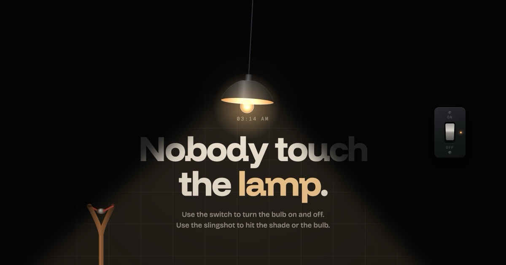

# Slingshot Lamp

> An interactive browser toy where a quiet lamp, a wall switch, and a slingshot turn into a small physics playground.

[](https://lamps.vercel.app/)



## Live Demo

Play it here: **[lamps.vercel.app](https://lamps.vercel.app/)**

## About

Slingshot Lamp is a lightweight, single-page interactive experience built with native web technologies. Explore the scene, switch the bulb on and off, pull back the slingshot, and see how the lamp reacts when the shade, bulb, or switch is hit.

The page also includes a live 24-hour clock with seconds, responsive controls for smaller screens, and optional sound effects generated directly in the browser.

## Features

- Interactive lamp and wall switch
- Physics-based slingshot interaction
- Shoot at the shade, bulb, or switch
- Swing the lamp shade by dragging it
- Bulb break effect with sparks and glass fragments
- Replace the bulb after it breaks
- Optional procedural sound effects
- Live `HH:MM:SS` clock
- Responsive desktop and mobile layout
- GitHub, LinkedIn, and personal website links
- No framework, build tool, or dependency installation required

## Controls

| Action | How to use |
| --- | --- |
| Toggle the light | Click the wall switch, or focus it and press `Enter` or `Space` |
| Fire the slingshot | Drag the pouch backward, then release |
| Move the shade | Drag the lamp shade |
| Replace the bulb | Click `replace bulb`, or press `R` after the bulb breaks |
| Toggle sound | Click `sound: on` or `sound: off` |

## Built With

- HTML5
- CSS3
- JavaScript
- Canvas 2D API
- Web Audio API

## Run Locally

This is a static website, so no package manager or build process is needed.

1. Clone or download the project.
2. Open `index.html` directly in a browser, or serve the folder with any local static server.
3. Start interacting with the lamp.

For a simple local server with Python:

```bash
python -m http.server 8000
```

Then open [http://localhost:8000](http://localhost:8000).

## Project Structure

```text
.
├── index.html          # Complete interactive experience
├── images/
│   ├── lamp.jpg        # Social preview image
│   ├── favicon.svg      # Browser favicon
│   └── ...             # App icons
└── README.md           # Project documentation
```

## Author

**Mim Akter**

- Website: [mimakter.tech](https://mimakter.tech/)
- GitHub: [github.com/mimakter31](https://github.com/mimakter31)
- LinkedIn: [linkedin.com/in/mimakter31](https://www.linkedin.com/in/mimakter31)

## License

This project is a personal interactive web experience by Mim Akter.
